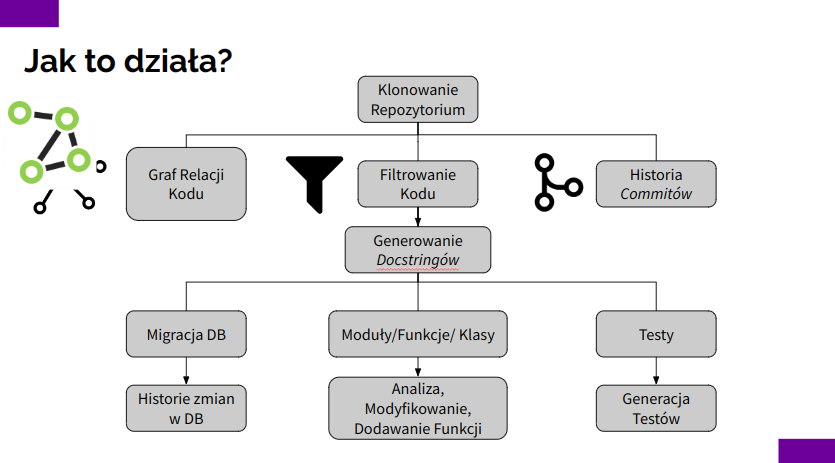
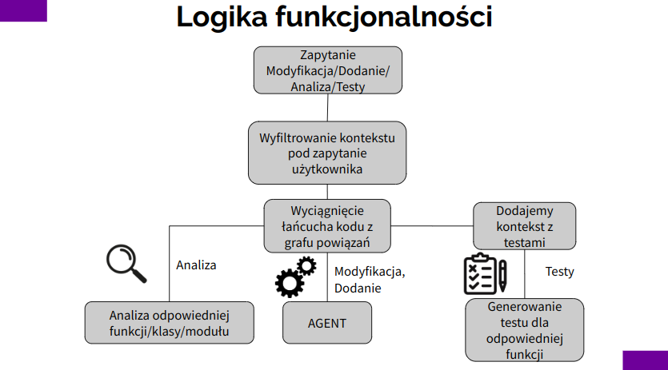

# Ogólna wysokopoziomowa koncepcja rozwiązania

Nasze rozwiązanie zakłada dwa etapy:

## Etap ekstrakcji wiedzy z zadanego repozytorium który:
- generuje deterministyczny graf zależności między elementami kodu (np. funkcjami, klasami)
- filtruje kod który jest ważny do zbudowania bazy wiedzy (vectorstore)
- tworzy / poprawia istniejącą dokumentacje kodu (docstringi)
- generuje historię zmian kodu oraz danych
- generuje testy (np. unittesty)
- tworzy bazę wiedzy indeksowaną osadzeniami (poprzez vectorstore)

## Etap użytkowania, który pozwala, za pomocą modelu językowego:
- Zadawać pytania o istniejący kod
- Modyfikować istniejącego kod
- Dodawać nowe funkcjonalności
- Analizować wskazane części kodu (np. pod kontem poprawności, podatności)

## Wizualizacja ekstrakcji wiedzy

## Wizualizacja etapu użytkowania

